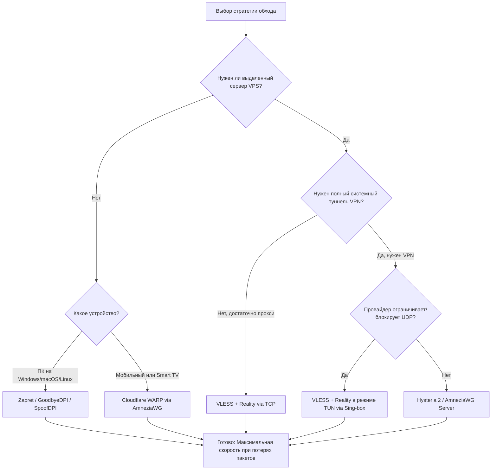

# 🛡️ Обход блокировок и замедлений (РКН)

Добро пожаловать в репозиторий со структурированными инструкциями, готовыми конфигурациями и скриптами для обхода DPI-блокировок, ограничений провайдеров и замедления ресурсов (таких как YouTube, Discord и заблокированные сайты).

> [!WARNING]
> Этот репозиторий предназначен для легитимных задач: защита приватности, обеспечение доступа к своим сервисам/данным и устойчивой связи. Соблюдайте законы своей юрисдикции и правила провайдера.

> [!TIP]
> Все методы протестированы на работоспособность в условиях ТСПУ и активных блокировок. Выбирайте инструмент в зависимости от ваших задач и устройств.

> [!NOTE]
> Перед началом настроек рекомендуется ознакомиться с **[теоретическим разделом про ТСПУ и архитектуру обхода](./theory.md)**, чтобы понимать принципы работы цензуры и причины возможных неполадок.

---

## 📖 Классификация методов: VPN, Прокси и Туннели

Для правильного выбора инструмента важно различать типы маршрутизации трафика:
*   **Системные VPN/Туннели (TUN-режим):** Перенаправляют абсолютно весь трафик операционной системы (включая игры, системные службы и фоновые приложения) в защищенный канал. Примеры: AmneziaWG, Cloudflare WARP.
*   **Прикладные прокси (Proxy-режим):** Работают на уровне конкретных приложений (например, браузер или Telegram). Требуют ручной настройки прокси (SOCKS5/HTTP) или использования специализированных клиентов. Пример: VLESS-XTLS-Reality в базовой конфигурации.
*   **Локальные манипуляторы трафика:** Не шифруют данные и не направляют их на удаленный сервер. Они работают локально на устройстве, изменяя TCP-пакеты (фрагментация, фейки) для запутывания DPI. Пример: Zapret, GoodbyeDPI, SpoofDPI.

---

## 🧱 Схема выбора метода обхода

Используйте эту диаграмму для выбора оптимального инструмента под вашу конфигурацию и требования:



---

## 🗺️ Карта методов и детальное сравнение

| Метод | Работает без VPS | Требования к серверу | Устойчивость к блокировке UDP | Пригодность для мобильного интернета | Пригодность для Smart TV | Сложность настройки |
| :--- | :---: | :--- | :---: | :---: | :---: | :---: |
| **[Zapret / DPI Bypass](./zapret/)** | 🟢 Да | Не требуется | 🟢 Не использует UDP (работает с TCP) | 🔴 Низкая (требует root/сложно запустить) | 🟡 Средняя (только через роутер) | 🟨 Средняя |
| **[VLESS-XTLS-Reality](./vless/)** | 🔴 Нет | 1 vCPU, 512 MB RAM, домен-маска | 🟢 Высокая (работает поверх TCP TLS) | 🟢 Высокая | 🟡 Зависит от ОС (Android TV - да; WebOS/Tizen - через роутер) | 🟧 Высокая¹ |
| **[Hysteria 2](./hysteria2/)** | 🔴 Нет | 1 vCPU, 512 MB RAM, самоподписной/легитимный сертификат | 🔴 Низкая (зависит от QUIC/UDP) | 🟢 Высокая (отличная скорость на ходу) | 🟡 Зависит от ОС (требуется совместимый клиент) | 🟨 Средняя |
| **[AmneziaWG Server](./vpn/)** | 🔴 Нет | 1 vCPU, 512 MB RAM | 🔴 Низкая (зависит от UDP) | 🟢 Высокая | 🟢 Высокая (есть нативный клиент) | 🟩 Легкая |
| **[Cloudflare WARP (AmneziaWG)](./warp/)** | 🟢 Да | Не требуется (использует узлы Cloudflare) | 🔴 Низкая (зависит от UDP) | 🟢 Высокая | 🟢 Высокая | 🟩 Легкая |

**Легенда сложности настройки:**
*   🟩 **Легкая:** Настройка в несколько кликов с помощью готового приложения/конфига.
*   🟨 **Средняя:** Требуется базовое понимание CLI, правка конфигурационных файлов.
*   🟧 **Высокая:** Требуется аренда зарубежного сервера (VPS), базовая работа с Docker, Linux CLI, а также покупка/поиск чистого домена-маски¹ (для Reality).

---

## 🚀 Быстрый старт (Quick Start)

Для настройки обхода выберите одну из трех базовых траекторий:

### Траектория 1: Локальный обход на ПК (Без VPS, бесплатно)
1. **Для Windows:** Перейдите в раздел [`/zapret`](./zapret/), скачайте готовый архив GoodbyeDPI и запустите от имени администратора скрипт [`windows_goodbyedpi_custom.bat`](./zapret/configs/windows_goodbyedpi_custom.bat).
2. **Для macOS:** Откройте терминал, установите SpoofDPI и запустите его с помощью скрипта [`macos_spoofdpi_custom.sh`](./zapret/configs/macos_spoofdpi_custom.sh).
3. Проверьте работу YouTube в браузере.

### Траектория 2: Мобильный интернет и Smart TV (Без VPS, бесплатно)
1. Установите клиент **AmneziaWG** на ваш телефон или Android TV.
2. Сгенерируйте файл конфигурации для Cloudflare WARP согласно инструкции в разделе [`/warp`](./warp/).
3. Импортируйте полученный `.conf` файл в приложение AmneziaWG и включите соединение.

### Траектория 3: Собственный сервер VPN (Максимальная надежность)
1. Арендуйте дешевый сервер VPS (см. раздел [Подбор хостинга](#-подбор-хостинга-vps-для-личного-vpn)).
2. Разверните связку **VLESS-XTLS-Reality** по инструкции в разделе [`/vless`](./vless/) с помощью Docker.
3. Установите клиент (Sing-box, v2rayN или FoXray) на ваши устройства и импортируйте сгенерированные конфигурации.

---

## 🏢 Подбор хостинга (VPS) для личного VPN

Для развертывания VLESS, Hysteria 2 или AmneziaWG вам понадобится собственный виртуальный сервер (VPS). Ниже приведен список хостингов, часто используемых для подобных задач.

### 💳 Принимают карты РФ (МИР, Visa, Mastercard) и рубли
1. **[Aeza](https://aeza.net/)**
   * **Локации:** Нидерланды, Германия, Швеция, Финляндия, Австрия, Россия.
   * **Плюсы:** Доступные тарифы (от ~120-150₽/мес), оплата картами РФ, СБП и криптой, высокая скорость (до 1 Гбит/с на дешевых тарифах), легкая регистрация.
   * **Рекомендуемая локация:** Нидерланды (NL) или Швеция (SE) для обхода РКН.
2. **[Timeweb Cloud](https://timeweb.cloud/)**
   * **Локации:** Польша, Нидерланды, Казахстан, Россия.
   * **Плюсы:** Надежный провайдер, удобная панель управления, оплата рублями, стабильный пинг.
3. **[JustHost](https://justhost.ru/)**
   * **Локации:** Нидерланды, Германия, США, Канада, Италия, Латвия и др. (более 20 стран).
   * **Плюсы:** Низкие цены, возможность гибкой настройки конфигурации (процессор, память), неограниченный трафик (обычно до 200 Мбит/с).
4. **[VDSina](https://vdsina.ru/)**
   * **Локации:** Нидерланды, Германия, Россия.
   * **Плюсы:** Посуточная оплата, быстрые сервера, поддержка карт РФ.
5. **[PQ Hosting](https://pq.hosting/)**
   * **Локации:** Более 30 стран мира.
   * **Плюсы:** Огромный выбор стран, оплата рублями и криптовалютой, поддержка 24/7.

### 🪙 Международные хостинги (нужна зарубежная карта или криптовалюта)
1. **[Hetzner](https://www.hetzner.com/)**
   * **Локации:** Германия, Финляндия, США.
   * **Плюсы:** Высокое качество сборки серверов, отличные цены.
   * **Минусы:** Требуется верификация паспорта при регистрации, не принимают карты РФ.
2. **[BuyVM](https://buyvm.net/)**
   * **Локации:** США, Люксембург.
   * **Плюсы:** Дешевые тарифы с честным безлимитным гигабитным каналом, принимают криптовалюту без жесткого KYC.

---

## 📱 Быстрый выбор под устройство

### 💻 Windows
* **Для YouTube / Discord (без аренды VPS):** [GoodbyeDPI (раздел Zapret)](./zapret/#windows). Работает локально, не шифрует остальной трафик.
* **Для полного VPN:** Клиент **NekoBox** или **v2rayN** с подключением к вашему серверу [VLESS](./vless/) или [Hysteria 2](./hysteria2/).

### 🍎 macOS
* **Для YouTube / Discord (без аренды VPS):** [SpoofDPI (раздел Zapret)](./zapret/#macos).
* **Для полного VPN:** Клиент **FoXray** или **Sing-box** из App Store с подключением к [VLESS](./vless/) / [Hysteria 2](./hysteria2/).

### 🐧 Linux
* **Для YouTube / Discord (без аренды VPS):** Оригинальный скрипт [zapret](./zapret/#linux).
* **Для полного VPN:** Клиент **Sing-box** или **NekoBox**.

### 📱 Android
* **Бесплатный вариант:** Клиент **AmneziaWG** с импортом конфигурации [WARP](./warp/).
* **Самый надежный вариант:** Клиент **NekoBox** / **Sing-box** с подключением к вашему [VLESS](./vless/) или [Hysteria 2](./hysteria2/).

### 🍏 iOS (iPhone / iPad)
* **Бесплатный вариант:** Клиент **AmneziaWG** с импортом [WARP](./warp/).
* **Самый надежный вариант:** Клиенты **FoXray**, **Streisand**, **V2Box** или **Sing-box** с протоколами [VLESS](./vless/) / [Hysteria 2](./hysteria2/).

### 🔌 Роутеры (Keenetic, OpenWrt)
* **Keenetic:** Поддерживает настройку [AmneziaWG](./vpn/) и установку [zapret](./zapret/) через OPKG (Entware).
* **OpenWrt:** Идеален для установки [zapret](./zapret/) (для разгрузки процессора при обходе YouTube/Discord) или настройки клиента **Sing-box** / **Passwall** для VLESS.

---

## ❓ FAQ и решение частых проблем

### 1. YouTube все равно не грузится (или грузится только в 144p) через GoodbyeDPI
* **Влияние Kyber в браузере:** В некоторых конфигурациях гибридный обмен ключей (флаг `#post-quantum-key-agreement` или `TLS 1.3 hybridized Post-Quantum Key Agreement` в Chrome/Edge) мешает корректной работе GoodbyeDPI. В современных версиях GoodbyeDPI это может не потребоваться, но на старых сборках рекомендуется отключить этот флаг в `chrome://flags` и перезапустить браузер.
* **Неверный TTL фейковых пакетов:** У вашего провайдера ТСПУ находится ближе или дальше, чем средние настройки.
  * **Решение:** Попробуйте изменить параметр `--desync-ttl` в файле запуска. Протестируйте значения от 2 до 8.

### 2. При включении VPN перестают открываться российские банки и Госуслуги
* **Проблема:** Российские государственные сайты и банки блокируют доступ с иностранных IP-адресов или не доверяют зарубежным сертификатам.
  * **Решение:** Настройте **политическую маршрутизацию** на клиенте. В клиентах NekoBox/Sing-box добавьте правило маршрутизации: направлять трафик для доменов/IP России (`geoip:ru`, `geosite:category-gov-ru`) напрямую (Bypass/Direct), а заблокированные ресурсы — через прокси-сервер. Подробная инструкция в разделе [Маршрутизация](./vless/routing.md).

### 3. Происходит утечка DNS (DNS Leak), блокировки не обходятся
* **Проблема:** Браузер или ОС отправляет DNS-запросы вашему провайдеру напрямую в открытом виде (симптомом является расхождение резолвинга с туннелем или получение провайдерской заглушки вместо реального IP).
  * **Решение:** Включите шифрование DNS-запросов (DNS-over-HTTPS / DoH) в настройках браузера или клиента. Обратите внимание, что DoH Cloudflare (`https://cloudflare-dns.com/dns-query`) часто блокируется провайдерами РФ. В качестве надежных альтернатив используйте DoH AdGuard (`https://dns.adguard-dns.com/dns-query`) или Quad9 (`https://dns.quad9.net/dns-query`).

### 4. Все настроил на VPS, но клиент VLESS/Hysteria пишет Timeout или моментально сбрасывает соединение
* **Проблема:** Рассинхронизация системного времени. Протоколы безопасности (включая Xray/Sing-box) требуют, чтобы время на сервере и клиенте совпадало с точностью до 90 секунд для защиты от атак повторного воспроизведения.
  * **Решение:** Синхронизируйте время на вашем VPS с помощью NTP-серверов. Выполните команду на сервере:
    ```bash
    sudo timedatectl set-ntp true
    ```
    Или перезапустите службу синхронизации:
    ```bash
    sudo systemctl enable --now systemd-timesyncd
    ```

---

## 🛠️ Содержимое репозитория

1. **[`/zapret`](./zapret/)** — локальный обход систем глубокого анализа пакетов (DPI) без использования внешних прокси-серверов.
2. **[`/vless`](./vless/)** — развертывание связки **Remnawave Panel + Xray Node** с протоколом VLESS-XTLS-Reality.
3. **[`/hysteria2`](./hysteria2/)** — серверная конфигурация Hysteria 2 для быстрой работы на нестабильных каналах связи.
4. **[`/warp`](./warp/)** — создание бесплатного и безлимитного туннеля Cloudflare Warp с обходом блокировки по протоколу WireGuard с помощью AmneziaWG.
5. **[`/vpn`](./vpn/)** — классический сервер AmneziaWG для шифрования всего трафика через собственную VPS.
6. **[`theory.md`](./theory.md)** — теоретические основы работы ТСПУ/DPI, подробное описание принципов обхода блокировок и анализ причин сбоев каждого метода.
7. **[`vless/domains.md`](./vless/domains.md)** — Выбор и покупка доменов (анонимные Njalla, Namesilo, Porkbun), доменные зоны и нюансы блокировок.
8. **[`vless/routing.md`](./vless/routing.md)** — Настройка маршрутизации на клиентах и роутерах, базы данных Geosite/GeoIP и предотвращение утечек DNS.
9. **[`vless/hostings.md`](./vless/hostings.md)** — Сравнение хостинг-провайдеров для VPN (MWS, Aeza, Selectel, BuyVM) и инструкции по сетевому тестированию серверов.
