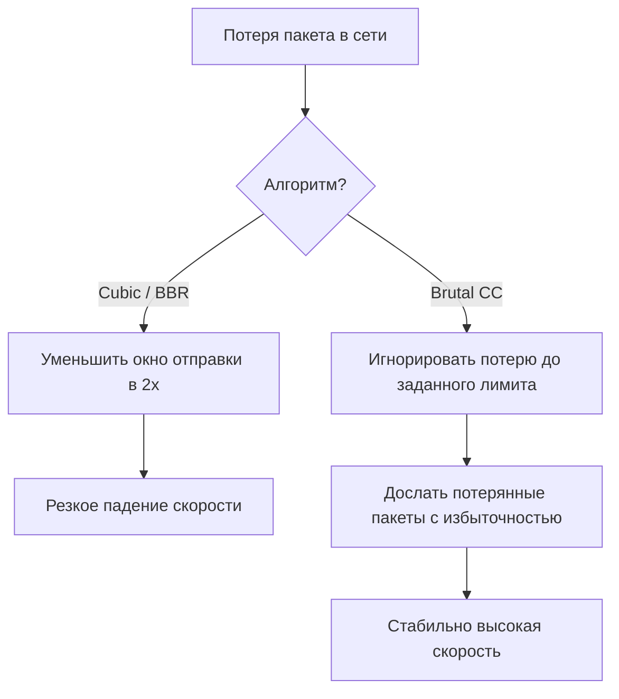

# 🏎️ Hysteria 2 (на базе QUIC)

**Hysteria 2** — это специализированный прокси-протокол, работающий поверх UDP на базе модифицированного протокола QUIC. Он разработан для обеспечения максимальной скорости и стабильности на нестабильных каналах связи с высокими потерями пакетов и большим пингом (например, мобильный интернет или Wi-Fi с плохим сигналом).

Основная особенность Hysteria 2 — собственный алгоритм контроля перегрузки (congestion control), который агрессивно отправляет пакеты, "пробивая" ограничения провайдеров, и маскирует соединение под стандартный веб-трафик HTTP/3.

---

## 📐 Принцип работы Hysteria 2

В отличие от VLESS-Reality (TCP + TLS), Hysteria 2 работает поверх **UDP/QUIC**:

```
Клиент  --[UDP/QUIC]--> Провайдер (ТСПУ)  --[UDP/QUIC]--> Сервер Hysteria 2 --> Интернет
                              |
                    DPI видит обычный QUIC/HTTP3 трафик
                    (как при обращении к Google или YouTube)
```

1.  **Маскировка под HTTP/3:** QUIC является стандартным транспортным протоколом для Chrome/Firefox при открытии YouTube, Google, Cloudflare. ТСПУ не может заблокировать QUIC без поломки половины интернета.
2.  **Brutal Congestion Control:** Вместо стандартного алгоритма контроля скорости (BBR/Cubic), Hysteria 2 использует агрессивный алгоритм Brutal. Он не снижает скорость при потерях пакетов (как делает обычный TCP), а продолжает «давить» на канал, компенсируя потери избыточными повторными отправками. Именно поэтому необходимо указать реальную скорость вашего канала в конфиге клиента — без этого Brutal может забить весь канал.
3.  **Port Hopping:** Hysteria 2 умеет на лету менять UDP-порт соединения, что защищает от блокировки по статическому порту.

---

## 🚀 Быстрый старт: Сервер

### 1. Генерация самоподписанного сертификата
Если у вас нет доменного имени, Hysteria 2 может работать с самоподписанным сертификатом. Сгенерируйте его на сервере одной командой:

```bash
mkdir -p /opt/hysteria/config && cd /opt/hysteria
openssl req -x509 -nodes -newkey rsa:2048 -keyout config/server.key -out config/server.crt -days 3650 -subj "/CN=www.microsoft.com"
```

### 2. Конфигурация Docker Compose
Создайте `docker-compose.yml` в папке `/opt/hysteria` на основе нашего шаблона:
*   Шаблон Docker Compose: [`docker-compose.yml`](./docker-compose.yml)
*   Шаблон конфигурации: [`config/server.yaml`](./config/server.yaml)

Отредактируйте `config/server.yaml`, указав свой сложный пароль в секции `auth.password`.

### 3. Запуск сервера
Запустите контейнер:
```bash
docker compose up -d
```
Логи можно посмотреть командой:
```bash
docker compose logs -f
```

---

## 🧠 Архитектурный разбор Brutal Congestion Control

Алгоритмы контроля перегрузки стандартного TCP (Cubic, BBR) оптимизированы для бесконфликтного сосуществования множества потоков в сети. Они трактуют потерю пакета или задержку (RTT) как сигнал перегрузки промежуточных узлов и превентивно снижают скорость отправки в 2-4 раза. 

На беспроводных сетях или перегруженных каналах с цензурой (где потери пакетов вызваны физическими помехами оператора или дропами на ТСПУ) классический TCP-стек резко снижает пропускную способность, даже если физическая полоса свободна.



### 1. Математика Brutal
Алгоритм **Brutal** построен по принципу фиксированной пропускной способности (Fixed Bandwidth Allocation) с динамической компенсацией потерь. Вместо подстройки под пропускную способность сети, Brutal отправляет пакеты со строго заданной клиентом скоростью ($Bandwidth_{target}$):

*   Сервер и клиент непрерывно обмениваются статистикой доставленных и потерянных пакетов.
*   Если реальная пропускная способность падает, а процент потерь пакетов ($Loss_{rate}$) не превышает критического порога (обычно 25-30%), Brutal не снижает скорость.
*   Он вычисляет избыточный объем данных для компенсации потерь:
    $$\text{Скорость отправки} = \frac{Bandwidth_{target}}{1 - Loss_{rate}}$$
*   Потерянные пакеты повторно отправляются в рамках этого же UDP-потока, заполняя всю доступную полосу.

### 2. Влияние настроек скорости на производительность
Из-за специфики Brutal критически важно указать верную скорость (Upload/Download) на клиенте:
*   **Указана завышенная скорость:** Клиент попытается отправлять данные быстрее, чем физически позволяет ваш интернет-канал. Это приведет к лавинообразному росту задержек (Bufferbloat), потере пакетов на вашем домашнем роутере и полной блокировке передачи данных.
*   **Указана заниженная скорость:** Вы искусственно ограничите скорость своего подключения. Алгоритм не будет пытаться задействовать свободную часть канала.
*   **Рекомендация:** Указывайте скорость на **10-15% ниже** реальной скорости вашего тарифа по результатам Speedtest.

---

## 🌪️ Концепция Port Hopping в UDP-протоколах

Динамическое переключение портов (**Port Hopping**) является методом обхода блокировок и деградации (throttling) UDP-трафика со стороны интернет-провайдеров.

### 1. Зачем это нужно?
Провайдерские ТСПУ анализируют сетевую активность пользователей по поведенческим паттернам (heuristics):
*   **Session Duration:** Длительный поток UDP-пакетов высокой интенсивности, идущий на один и тот же зарубежный IP-адрес и порт (например, `443/udp`), быстро классифицируется как VPN-туннель. Скорость такого потока принудительно снижается (throttling), либо сессия обрывается.
*   **Port Blocking:** Цензор может заблокировать конкретный нестандартный UDP-порт вашего сервера.
*   **Решение:** С помощью Port Hopping клиент отправляет каждый последующий пакет (или группу пакетов) на случайный порт из выделенного диапазона портов сервера. Для DPI это выглядит как множество независимых кратковременных UDP-сессий на разные порты, что усложняет классификацию трафика.

### 2. Механизм переключения на клиенте
На стороне сервера все входящие порты диапазона (например, `20000-50000`) перенаправляются внутренними правилами брандмауэра на один реальный рабочий порт Hysteria 2 (`443`). 
На стороне клиента:
*   Приложение получает список или диапазон доступных портов.
*   При возникновении задержки или потере определенного количества пакетов (Trigger Event) клиент мгновенно переключает исходящий UDP-сокет на следующий случайный порт из диапазона.
*   Поскольку QUIC поддерживает функцию **Connection Migration**, сессия не разрывается при смене порта: сервер узнает клиента по уникальному идентификатору `Connection ID` в заголовке QUIC-пакета и продолжает передачу данных без повторного TLS-рукопожатия.

---

## 🧰 Troubleshooting сетевого уровня (UDP & MTU)

### 1. Диагностика пропускной способности UDP
Перед настройкой Hysteria 2 убедитесь, что ваш провайдер не блокирует UDP полностью.
*   **Тест с помощью iperf3 (запустите на сервере):**
    ```bash
    iperf3 -s -p 5201
    ```
*   **Запуск на клиенте (тест UDP на скорости 10 Мбит/с):**
    ```bash
    iperf3 -c <IP_СЕРВЕРА> -u -b 10M -p 5201
    ```
    Если потери пакетов (Lost Packets) близки к 100%, ваш провайдер полностью блокирует или режет UDP-трафик. В этом случае Hysteria 2 работать не будет, используйте Reality (TCP).

### 2. Влияние MTU на фрагментацию пакетов
Стандартный размер кадра в сетях Ethernet составляет 1500 байт. Для UDP-туннелей чистый размер полезных данных меньше из-за накладных расходов заголовков IP, UDP и QUIC/TLS.
*   Если размер собранного пакета превышает MTU промежуточного узла провайдера, пакет фрагментируется (делится на части).
*   Многие провайдерские DPI/ТСПУ настроены на автоматический сброс (drop) фрагментированных UDP-пакетов для предотвращения DDoS-атак и сканирования сети.
*   **Решение:** Уменьшите размер MTU в настройках клиента Hysteria 2 (параметр `mtu` в конфиге, рекомендуемые значения: `1350`, `1250` или `1200`). Занижение MTU предотвратит фрагментацию на сетевом уровне, пакеты будут доходить целыми, что восстановит стабильность тунлеля.

---

## 📱 Настройка клиентов

### 💻 Windows / Android (NekoBox / v2rayNG)
1. Создайте новое подключение вручную.
2. Выберите тип протокола: **Hysteria 2**.
3. Укажите адрес сервера: `IP-адрес-сервера:443` (или диапазон портов, если настроен Port Hopping: `IP-адрес:443,20000-50000`).
4. Вставьте ваш пароль.
5. В поле **SNI** впишите домен маскировки (например, `www.microsoft.com`).
6. Включите галочку **Allow Insecure** (разрешить небезопасный SSL), если используете самоподписанный сертификат.
7. Задайте скорость вашего тарифа (Upload/Download) в настройках соединения, иначе протокол Brutal/BBR может работать неэффективно.

### 🍎 macOS / iOS (FoXray / Streisand / Sing-box)
* **FoXray:** Перейдите в добавление новой конфигурации, выберите Hysteria 2, заполните поля Host, Port, Password, SNI и переключите тумблер Allow Insecure в положение ON.
* **Sing-box:** Поддерживает Hysteria 2 нативно. Конфигурацию можно импортировать через JSON-файл клиента.

---

## ⚠️ Нюансы и ограничения Hysteria 2

1.  **Скорость обязательна в конфиге клиента:**
    Если вы не укажете реальную скорость вашего канала (Up/Down) в настройках клиента, алгоритм Brutal не сможет правильно рассчитать допустимый порог отправки пакетов. В результате он либо не «раскроется» на полную, либо забьет канал так, что интернет встанет полностью. Указывайте скорость на 10-15% ниже реальной.
2.  **Баг отображения онлайна в Remnawave 2.7.0:**
    При управлении Hysteria 2 через панель Remnawave версии 2.7.0 (Xray ядро 26.3.27) пользователи, подключенные по Hysteria 2, не отображаются в списке онлайн, и их трафик не учитывается панелью. Для исправления обновите ядро Xray ноды до версии 26.6.1+ (инструкция в [`vless/README.md`](../vless/README.md), раздел «Ручное обновление ядра Xray»).
3.  **Мобильные операторы (Tele2, Yota, Мегафон):**
    Мобильные операторы в РФ особенно агрессивно блокируют длительные UDP-сессии. Если Hysteria 2 не подключается или периодически разрывается, обязательно настройте Port Hopping (см. выше) и используйте диапазон не менее 30 000 портов (например, `20000-50000`).
4.  **Потребление батареи:**
    Из-за агрессивного алгоритма Brutal и постоянных UDP-пакетов Hysteria 2 расходует больше заряда батареи мобильного устройства, чем TCP-протоколы (VLESS-Reality). На телефонах рекомендуется использовать его только при необходимости максимальной скорости или нестабильном канале.
