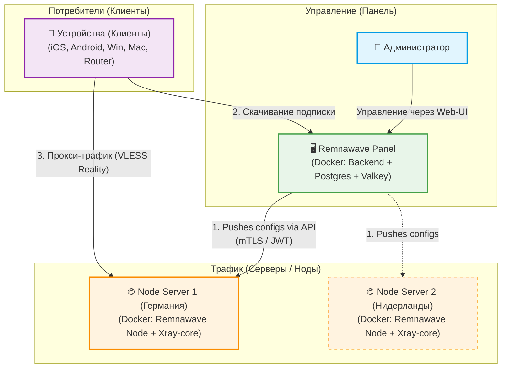

# 🛡️ VLESS-XTLS-Reality (Remnawave Panel + Xray)

**VLESS-XTLS-Reality** — на сегодняшний день один из самых устойчивых и современных протоколов для обхода блокировок. Он маскирует VPN-трафик под стандартное HTTPS-соединение (TLS) с любым популярным зарубежным сайтом (например, `apple.com` или `microsoft.com`). Для ТСПУ/DPI провайдера это выглядит так, будто вы просто зашли на этот сайт, что делает блокировку протокола практически невозможной без блокировки самого маскировочного сайта.

В этой инструкции мы настроим **Remnawave** — современную и легкую панель для управления пользователями и серверами (нодами).

---

## 📐 Архитектура системы (Наглядно)



---

## 🚀 Шаг 1. Развертывание Remnawave Panel (Управляющий сервер)

Панель администратора устанавливается на любой сервер (можно использовать самый дешевый VPS с 1 ГБ ОЗУ). Она отвечает за базу данных пользователей и генерацию подписок.

1. Установите Docker и Docker Compose на ваш VPS:
   ```bash
   curl -fsSL https://get.docker.com -o get-docker.sh
   sudo sh get-docker.sh
   ```
2. Создайте рабочую директорию и скопируйте файлы:
   ```bash
   mkdir -p /opt/remnawave && cd /opt/remnawave
   ```
   *(Создайте в этой папке файлы `docker-compose.yml` и `.env` на основе шаблонов [`docker-compose.yml`](./docker-compose.yml) и [`.env.example`](./.env.example) из этого репозитория).*

3. Отредактируйте `.env`:
   * Сгенерируйте секретные ключи: `openssl rand -hex 32` и вставьте их в `JWT_AUTH_SECRET` и `APP_SECRET`.
   * Измените `POSTGRES_PASSWORD` и обновите его в `DATABASE_URL`.
   * Задайте ваш домен в `PANEL_DOMAIN` и `SUB_PUBLIC_DOMAIN`.

4. Запустите панель:
   ```bash
   docker compose up -d
   ```
5. Откройте панель в браузере по адресу `http://ip-сервера:3000` (или по вашему домену, если настроен Nginx/Caddy реверс-прокси).
6. Зарегистрируйте первого пользователя — он автоматически станет **Super-Admin**.

---

## 🌐 Шаг 2. Добавление и настройка Xray Node (Сервер трафика)

Нода — это непосредственно VPN-сервер, через который пойдет трафик пользователей. Ноду можно поставить как на тот же сервер, где стоит панель, так и на любой другой VPS в другой стране.

1. Войдите в **Remnawave Panel** под администратором.
2. Перейдите во вкладку **Nodes** -> нажмите кнопку **+ (Add Node)**.
3. Введите название ноды, ее публичный IP и **Node Port** (порт, по которому панель будет общаться с нодой, например `2222`).
4. Нажмите **Copy docker-compose.yml**. Панель сгенерирует готовый файл с ключами шифрования.
5. Зайдите по SSH на сервер ноды, создайте папку:
   ```bash
   mkdir -p /opt/remnanode && cd /opt/remnanode
   ```
6. Создайте `docker-compose.yml`, вставьте скопированный текст и запустите:
   ```bash
   docker compose up -d
   ```
7. Убедитесь, что порт ноды (в примере `2222`) открыт в брандмауэре вашего сервера.
8. Вернитесь в панель, нажмите **Next**, выберите профиль конфигурации и подтвердите создание.

---

## 🛠️ Шаг 3. Создание профиля конфигурации VLESS-XTLS-Reality

Для того чтобы нода знала, как именно обрабатывать трафик, нужно создать Config Profile в панели Remnawave:

1. Перейдите в **Config Profiles** -> **Create Profile**.
2. Выберите тип протокола: **VLESS**.
3. Настройте блок **Reality**:
   * **Dest (Маскировочный адрес):** `images.apple.com:443` или `dl.google.com:443`.
   * **Server Names (SNI):** `images.apple.com` или `dl.google.com` (должно соответствовать Dest).
   * **Private Key** и **Public Key:** Сгенерируйте их прямо в панели (кнопка Generate). Public Key будет отправлен клиентам.
   * **Short ID:** Сгенерируйте случайный hex-код (например, `8f64b192`).
4. Примените этот профиль к вашей Ноде.

---

## 📱 Шаг 4. Настройка клиентов под разные устройства

Remnawave предоставляет для каждого пользователя **Subscription Link** (ссылку подписки). Клиенты скачивают настройки по этой ссылке, и профили автоматически обновляются.

### 💻 Windows
1. Скачайте клиент **NekoBox** ([GitHub](https://github.com/MatsuriDayo/nekoray/releases)).
2. Откройте программу, перейдите в **Preferences** -> **Groups**.
3. Нажмите **New**, выберите Type: **Subscription**, вставьте вашу ссылку подписки из Remnawave.
4. Нажмите **Update Subscription**. Соединение появится в списке.
5. Нажмите правой кнопкой мыши по соединению -> **Start**. Включите галочку **System Tunnel** (системный прокси).

### 🍎 macOS
1. Установите приложение **FoXray** (доступно в Mac App Store) или **Sing-box**.
2. Вставьте ссылку подписки в раздел **Subscriptions**.
3. Обновите подписку и подключитесь.

### 🐧 Linux
1. Используйте консольный клиент **Sing-box** ([Инструкция](https://sing-box.sagernet.org/)).
2. Сгенерируйте конфигурационный файл Sing-box через API Remnawave (ссылка подписки выдает готовый JSON для sing-box при добавлении заголовка или параметра `?flag=sing-box`).
3. Запустите демон: `sudo systemctl start sing-box`.

### 📱 Android
1. Установите **NekoBox для Android** ([GitHub](https://github.com/MatsuriDayo/NekoBoxForAndroid/releases)) или **v2rayNG** из Google Play.
2. Откройте боковое меню -> **Groups** -> **Add Group**. Выберите тип **Subscription** и укажите ссылку.
3. Вернитесь на главный экран, нажмите кнопку обновить в правом верхнем углу.
4. Выберите полученный сервер и нажмите на иконку подключения внизу.

### 🍏 iOS (iPhone / iPad)
1. Установите **FoXray** или **Streisand** из App Store.
2. Перейдите во вкладку подписок, нажмите **+**, вставьте ссылку подписки.
3. После обновления нажмите на кнопку подключения.

### 🔌 Роутеры (Keenetic / OpenWrt)
* **OpenWrt:** Установите пакет **HomeProxy** или **Passwall**. Они поддерживают парсинг ссылок подписок VLESS. Вставьте вашу ссылку подписки из панели в менеджер подписок плагина, выберите протокол VLESS-Reality и настройте маршрутизацию (например, пускать через VPN только заблокированные сайты).
* **Keenetic:** Прямая поддержка VLESS-Reality на уровне встроенного ПО роутеров Keenetic ожидается, на данный момент настройка возможна через среду Entware путем установки и ручной конфигурации демона `sing-box`.
