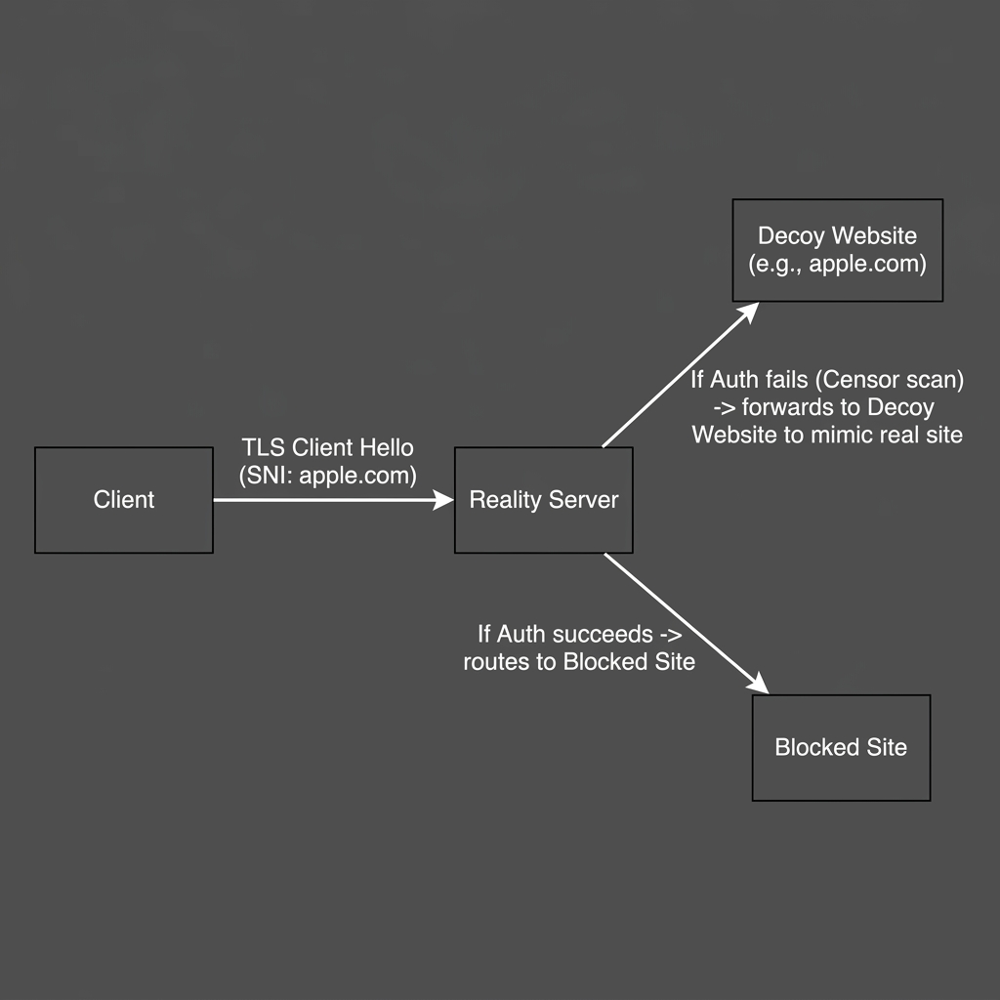
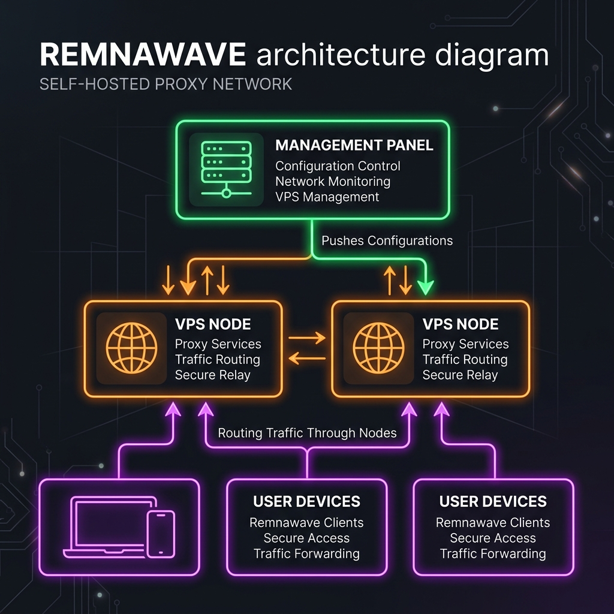

# 🛡️ VLESS-XTLS-Reality (Remnawave Panel + Xray)

**VLESS-XTLS-Reality** — на сегодняшний день один из самых устойчивых и современных протоколов для обхода блокировок. Он маскирует VPN-трафик под стандартное HTTPS-соединение (TLS) с любым популярным зарубежным сайтом (например, `apple.com` или `microsoft.com`). Для ТСПУ/DPI провайдера это выглядит так, будто вы просто зашли на этот сайт, что делает блокировку протокола практически невозможной без блокировки самого маскировочного сайта.

В этой инструкции мы настроим **Remnawave** — современную и легкую панель для управления пользователями и серверами (нодами).

---

## 📐 Принцип работы VLESS-XTLS-Reality

Reality перенаправляет трафик по следующей схеме:


1. **Клиент** отправляет стандартный запрос рукопожатия `TLS Client Hello` с указанием домена маски (например, `apple.com`). Внутри запроса зашифрован секретный токен авторизации.
2. **Reality Сервер** перехватывает этот запрос:
   * **Если авторизация пройдена (клиент легитимен):** Устанавливается защищенный VPN-туннель до заблокированных сайтов.
   * **Если авторизация не пройдена (сканирование цензора/случайный пользователь):** Сервер работает как прозрачный прокси и перенаправляет запрос на оригинальный сайт `apple.com`. Цензор получает оригинальный ответ от Apple и считает сервер безопасным.

---

## 🖥️ Схема инфраструктуры Remnawave



---

## 🚀 Шаг 1. Развертывание Remnawave Panel (Управляющий сервер)

Панель администратора устанавливается на любой сервер (можно использовать самый дешевый VPS с 1 ГБ ОЗУ). Она отвечает за базу данных пользователей и генерацию подписок.

1. Установите Docker и Docker Compose на ваш VPS:
   ```bash
   curl -fsSL https://get.docker.com -o get-docker.sh
   sudo sh get-docker.sh
   ```
2. Создайте рабочую директорию и скопируйте файлы:
   ```bash
   mkdir -p /opt/remnawave && cd /opt/remnawave
   ```
   *(Создайте в этой папке файлы `docker-compose.yml` и `.env` на основе шаблонов [`docker-compose.yml`](./docker-compose.yml) и [`.env.example`](./.env.example) из этого репозитория).*

3. Отредактируйте `.env`:
   * Сгенерируйте секретные ключи: `openssl rand -hex 32` и вставьте их в `JWT_AUTH_SECRET` и `APP_SECRET`.
   * Измените `POSTGRES_PASSWORD` и обновите его в `DATABASE_URL`.
   * Задайте ваш домен в `PANEL_DOMAIN` и `SUB_PUBLIC_DOMAIN`.

4. Запустите панель:
   ```bash
   docker compose up -d
   ```
5. Откройте панель в браузере по адресу `http://ip-сервера:3000` (или по вашему домену, если настроен реверс-прокси).
6. Зарегистрируйте первого пользователя — он автоматически станет **Super-Admin**.

### 🔒 Настройка Remnawave Reverse Proxy
Реверс-прокси необходим для защиты веб-интерфейса панели, автоматической выписки SSL-сертификатов и правильного проксирования соединений.
*   **Автоматическая установка:** Для развертывания реверс-прокси выполните команду:
    ```bash
    bash <(wget -qO- https://raw.githubusercontent.com/eGamesAPI/remnawave-reverse-proxy/refs/heads/main/install_remnawave.sh)
    ```
    *Альтернативный запуск (если wget падает с ошибками) с выводом логов установки в файл:*
    ```bash
    bash -x <(curl -4 -Ls https://raw.githubusercontent.com/eGamesAPI/remnawave-reverse-proxy/refs/heads/main/install_remnawave.sh | sed 's/wget -q -O/curl -4 -Ls -o/g') 2>&1 | tee install.log
    ```
*   **Nginx vs Caddy (Важно):** При использовании Nginx перед Xray нодами в логах Nginx могут возникать частые ошибки сокетов (`connection reset`). Это баг буферизации сокетов Nginx с кастомным ядром ноды. Для решения проблемы рекомендуется использовать веб-сервер **Caddy** — он обрабатывает Xray-туннели без обрывов сессий.
*   **Баг авторизации OAuth в v2.7.4:** При авторизации через GitHub или Яндекс-аккаунты после редиректа на страницу `/oauth2/callback/github` может возникнуть ошибка `ERR_CONNECTION_RESET`. Если это происходит, переведите авторизацию на Telegram OAuth или используйте стабильную версию панели 2.7.2.

---

## 🌐 Шаг 2. Добавление и настройка Xray Node (Сервер трафика)

Нода — это непосредственно VPN-сервер, через который пойдет трафик пользователей. Ноду можно поставить как на тот же сервер, где стоит панель, так и на любой другой VPS в другой стране.

1. Войдите в **Remnawave Panel** под администратором.
2. Перейдите во вкладку **Nodes** -> нажмите кнопку **+ (Add Node)**.
3. Введите название ноды, ее публичный IP и **Node Port** (порт, по которому панель будет общаться с нодой, например `2222`).
4. Нажмите **Copy docker-compose.yml**. Панель сгенерирует готовый файл с ключами шифрования.
5. Зайдите по SSH на сервер ноды, создайте папку:
   ```bash
   mkdir -p /opt/remnanode && cd /opt/remnanode
   ```
6. Создайте `docker-compose.yml`, вставьте скопированный текст и запустите:
   ```bash
   docker compose up -d
   ```
7. Убедитесь, что порт ноды (в примере `2222`) открыт в брандмауэре вашего сервера.
8. Вернитесь в панель, нажмите **Next**, выберите профиль конфигурации и подтвердите создание.

### 🛠️ Ручное обновление ядра Xray в RemnaNode (Фикс Hysteria 2)
В нодах версии **2.7.0** (использующих Xray **26.3.27**) есть критический баг: при работе Hysteria 2 панель не отображает пользователей онлайн и не считает их трафик. Для исправления обновите ядро ноды до версии **26.6.1** или новее:
1.  Подключитесь к VPS с нодой по SSH.
2.  Выполните команды:
    ```bash
    mkdir -p /opt/remnanode/custom-xray && cd /opt/remnanode/custom-xray
    apt update && apt install wget unzip -y
    wget https://github.com/XTLS/Xray-core/releases/download/v26.6.1/Xray-linux-64.zip
    unzip -o Xray-linux-64.zip
    ```
3.  Откройте конфигурационный файл docker-compose:
    ```bash
    nano /opt/remnanode/docker-compose.yml
    ```
4.  В секции `volumes` контейнера ноды пропишите путь к новому ядру:
    ```yaml
    volumes:
      - '/opt/remnanode/custom-xray/xray:/usr/local/bin/xray:ro'
    ```
5.  Перезапустите контейнеры:
    ```bash
    cd /opt/remnanode && docker compose down && docker compose up -d
    ```
6.  Проверьте версию Xray: `docker exec -it remnanode xray version` (должно быть v26.6.1).

---

## 🛠️ Шаг 3. Создание профиля конфигурации VLESS-XTLS-Reality

Для того чтобы нода знала, как именно обрабатывать трафик, нужно создать Config Profile в панели Remnawave:

1. Перейдите в **Config Profiles** -> **Create Profile**.
2. Выберите тип протокола: **VLESS**.
3. Настройте блок **Reality**:
   * **Dest (Маскировочный адрес):** `images.apple.com:443` или `dl.google.com:443`.
   * **Server Names (SNI):** `images.apple.com` или `dl.google.com` (должно соответствовать Dest).
   * **Private Key** и **Public Key:** Сгенерируйте их прямо в панели (кнопка Generate). Public Key будет отправлен клиентам.
   * **Short ID:** Сгенерируйте случайный hex-код (например, `8f64b192`).
4. Примените этот профиль к вашей Ноде.

---

## 📱 Шаг 4. Настройка клиентов под разные устройства

Remnawave предоставляет для каждого пользователя **Subscription Link** (ссылку подписки). Клиенты скачивают настройки по этой ссылке, и профили автоматически обновляются.

### 💻 Windows
1. Скачайте клиент **NekoBox** ([GitHub](https://github.com/MatsuriDayo/nekoray/releases)).
2. Откройте программу, перейдите в **Preferences** -> **Groups**.
3. Нажмите **New**, выберите Type: **Subscription**, вставьте вашу ссылку подписки из Remnawave.
4. Нажмите **Update Subscription**. Соединение появится в списке.
5. Нажмите правой кнопкой мыши по соединению -> **Start**. Включите галочку **System Tunnel** (системный прокси).

### 🍎 macOS
1. Установите приложение **FoXray** (доступно в Mac App Store) или **Sing-box**.
2. Вставьте ссылку подписки в раздел **Subscriptions**.
3. Обновите подписку и подключитесь.

### 🐧 Linux
1. Используйте консольный клиент **Sing-box** ([Инструкция](https://sing-box.sagernet.org/)).
2. Сгенерируйте конфигурационный файл Sing-box через API Remnawave (ссылка подписки выдает готовый JSON для sing-box при добавлении заголовка или параметра `?flag=sing-box`).
3. Запустите демон: `sudo systemctl start sing-box`.

### 📱 Android
1. Установите **NekoBox для Android** ([GitHub](https://github.com/MatsuriDayo/NekoBoxForAndroid/releases)) или **v2rayNG** из Google Play.
2. Откройте боковое меню -> **Groups** -> **Add Group**. Выберите тип **Subscription** и укажите ссылку.
3. Вернитесь на главный экран, нажмите кнопку обновить в правом верхнем углу.
4. Выберите полученный сервер и нажмите на иконку подключения внизу.

### 🍏 iOS (iPhone / iPad)
1. Установите **FoXray** или **Streisand** из App Store.
2. Перейдите во вкладку подписок, нажмите **+**, вставьте ссылку подписки.
3. После обновления нажмите на кнопку подключения.

### 🔌 Роутеры (Keenetic / OpenWrt)
* **OpenWrt:** Установите пакет **HomeProxy** или **Passwall**. Они поддерживают парсинг ссылок подписок VLESS. Вставьте вашу ссылку подписки из панели в менеджер подписок плагина, выберите протокол VLESS-Reality и настройте маршрутизацию (например, пускать через VPN только заблокированные сайты).
* **Keenetic:** Настройка возможна через среду Entware путем установки и ручной конфигурации демона `sing-box`.

---

## 🛠️ Диагностика, тестирование и обслуживание системы

### 📶 Отключение IPv6 на хост-серверах (Лечение таймаутов)
У многих хостингов некорректно настроена маршрутизация IPv6, что вызывает секундные задержки и таймауты при Reality-подключениях. Для полного отключения IPv6 на сервере выполните:
```bash
cat << 'EOF' > /etc/sysctl.d/99-disable-ipv6.conf
net.ipv6.conf.all.disable_ipv6 = 1
net.ipv6.conf.default.disable_ipv6 = 1
net.ipv6.conf.lo.disable_ipv6 = 1
EOF
sysctl -p /etc/sysctl.d/99-disable-ipv6.conf
sed -i 's/GRUB_CMDLINE_LINUX_DEFAULT="/&ipv6.disable=1 /' /etc/default/grub
update-grub
sed -i 's/#AddressFamily any/AddressFamily inet/' /etc/ssh/sshd_config
systemctl restart ssh
```

### 🛰️ Проверка геолокации IP-адреса сервером Google
Для проверки, под какой страной Google видит ваш сервер (важно при проверке работы Warp-native):
```bash
curl -4 -s --user-agent "Mozilla/5.0 (X11; Linux x86_64; rv:130.0) Gecko/20100101 Firefox/130.0" https://www.google.com | sed -n 's/.*"[a-z]\{2\}_\([A-Z]\{2\}\)".*/\1/p'
```

### 🌐 Базовая проверка доступности порта и TLS-рукопожатия ноды
Позволяет быстро локализовать блокировку порта на ТСПУ без отправки mTLS-ключей:
```bash
curl -v --connect-timeout 5 https://<IP_АДРЕС_НОДЫ>:443 -k
```
*Нода защищена mTLS, поэтому при успешном соединении она сбросит сессию по ошибке рукопожатия, но команда подтвердит, что порт открыт и отвечает.*

### 🔄 Обслуживание и обновление контейнеров
*   **Обновление панели и баз данных:**
    ```bash
    cd /opt/remnawave && docker compose pull && docker compose down && docker compose up -d && docker compose logs -f
    ```
*   **Обновление страницы подписок (Subscription Page):**
    ```bash
    cd /opt/remnawave && docker compose pull remnawave-subscription-page && docker compose down remnawave-subscription-page && docker compose up -d remnawave-subscription-page && docker compose logs -f remnawave-subscription-page
    ```
*   **Обновление ноды (RemnaNode):**
    ```bash
    cd /opt/remnanode && docker compose pull && docker compose down && docker compose up -d && docker compose logs -f
    ```

### ⏰ Исправление зависания нод в Cron (SSL Renew Bug)
По умолчанию скрипты реверс-прокси прописывают в cron-задачу еженедельный перезапуск докера через `docker compose down && docker compose up`, что отключает панель и все ноды каждое воскресенье в 5:00 утра.
*   **Исправление:** Откройте crontab (`crontab -e`) и замените полную остановку на перезапуск только Nginx/Caddy:
    ```cron
    0 5 * * 0 ufw allow 80 && /usr/bin/certbot renew --quiet && ufw delete allow 80 && ufw reload && cd /opt/remnawave && docker compose restart nginx
    ```

### 🔑 Тестирование API Remnawave (Добавление пользователя через curl)
Для ручной проверки работы API бэкенда панели:
```bash
curl -X POST https://panel.yourdomain.com/api/users \
  -H "Cookie: Cookie=Cookie" \
  -H "Authorization: Bearer ВАШ_API_ТОКЕН" \
  -H "Content-Type: application/json" \
  -d '{
    "username": "TestUser",
    "uuid": "сгенерированный-uuid-клиента",
    "shortUuid": "короткий-id",
    "expireAt": "2026-12-31T23:59:59.999Z",
    "status": "ACTIVE",
    "trafficLimitBytes": 107374182400,
    "trafficLimitStrategy": "NO_RESET"
  }'
```

---

## 🛰️ Обход «Белых Списков» (БС)
Если провайдеры отключат доступ ко всему внешнему интернету, оставив только российские сайты из белого списка, обычные Reality-подключения перестанут работать. Для решения этой проблемы ознакомьтесь с руководством **[Обход «Белых Списков» (БС) через VLESS и CDN](./whitelist-bypass.md)**.


---

## 🔀 Дополнительные настройки и оптимизация
*   **[Выбор и покупка доменов (Анонимность и нюансы)](./domains.md)** — Как и где покупать анонимные домены (Njalla, Porkbun), какие зоны выбирать и как обходить блокировки доменов со стороны цензора.
*   **[Маршрутизация трафика на клиентах](./routing.md)** — Подробное руководство по разделению трафика (Geosite/GeoIP), предотвращению утечек DNS и настройке маршрутизации на роутерах (OpenWrt/Keenetic).
*   **[Выбор и тестирование VPS-хостингов](./hostings.md)** — Сравнение провайдеров (MWS, Aeza, Selectel), специфика мобильных IP-адресов МТС и методы тестирования серверов (Speedtest, TCP-MTR, IPQS, проверка доступности).
