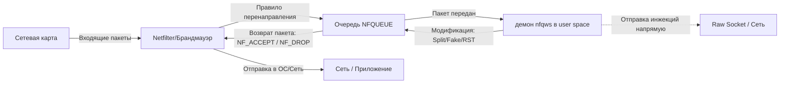

# ⚡ Локальный обход DPI (Zapret, GoodbyeDPI, SpoofDPI)

Обход систем глубокого анализа пакетов (DPI) позволяет восстановить доступ к YouTube, Discord и другим заблокированным ресурсам без использования внешних VPN/прокси серверов. Трафик не шифруется и идет напрямую к серверам (например, Google Video), обеспечивая максимальную скорость и минимальный пинг.

---

## 💻 Windows (GoodbyeDPI)
Для ОС Windows решением является **GoodbyeDPI** от ValdikSS.

### Установка и настройка:
1. Скачайте последнюю версию архива `goodbyedpi-...-release.zip` с официального репозитория [ValdikSS/GoodbyeDPI](https://github.com/ValdikSS/GoodbyeDPI/releases).
2. Распакуйте архив в удобную папку (например, `C:\goodbyedpi`).
3. Для настройки обхода YouTube и Discord откройте текстовым редактором файл `service_install_russia_blacklist.cmd`.
4. Найдите строчку запуска службы `sc create "GoodbyeDPI" ...` и отредактируйте параметры запуска.
5. Запустите этот скрипт от имени Администратора для установки службы. Она будет автоматически запускаться при старте системы.

### Рекомендуемые параметры запуска (актуальные на 2026 год):
Если стандартные пресеты (`-9`) не помогают, попробуйте следующий набор параметров:
```cmd
-e 1 -q --fake-gen 2 --fake-resend 2 --split-pos 3 --desync-ttl 3 --native-frag
```
*   `-e 1` — включить фрагментацию SNI.
*   `-q` — отключить повторные попытки при ошибках.
*   `--fake-gen 2 --fake-resend 2` — параметры генерации фейковых пакетов.
*   `--split-pos 3` — позиция деления TCP пакета.
*   `--desync-ttl 3` — TTL для обхода ТСПУ провайдеров.

*Готовый кастомный bat-файл лежит по пути: [`configs/windows_goodbyedpi_custom.bat`](./configs/windows_goodbyedpi_custom.bat).*

---

## 🍎 macOS (SpoofDPI)
Для macOS решением является **SpoofDPI** от xvzc.

### Установка:
Удобнее всего установить через менеджер пакетов Homebrew:
```bash
brew install xvzc/tap/spoofdpi
```

### Запуск:
По умолчанию запуск производится командой `spoofdpi`. Однако для лучшего обхода YouTube/Discord на провайдерах РФ рекомендуется использовать дополнительные параметры:
```bash
spoofdpi --enable-doh --window-size 30 --pattern "googlevideo.com|discord"
```
*   `--enable-doh` — использовать DNS over HTTPS (предотвращает подмену DNS).
*   `--window-size 30` — уменьшить размер TCP окна для дефрагментации трафика.
*   `--pattern` — применять обход только для указанных доменов (чтобы не направлять сторонние запросы).

*Скрипт для автоматического автозапуска (launchd) лежит по пути: [`configs/macos_spoofdpi_custom.sh`](./configs/macos_spoofdpi_custom.sh).*

---

## 🐧 Linux (zapret)
Оригинальный **zapret** от bol-van — мощный инструмент обхода DPI, работающий как демон на базе iptables/nftables.

### Установка:
1. Склонируйте репозиторий:
   ```bash
   git clone --depth=1 https://github.com/bol-van/zapret.git /opt/zapret
   ```
2. Перейдите в папку и запустите установщик:
   ```bash
   cd /opt/zapret && sudo ./install_easy.sh
   ```
3. Скрипт задаст вопросы о типе вашей сети, провайдере и установит необходимые пакеты (curl, nftables/iptables).
4. Во время установки выберите автоматическую настройку или настройте параметры вручную в файле `/etc/zapret/config`.

### Конфигурация (`/etc/zapret/config`):
Для обхода ТСПУ и восстановления YouTube отредактируйте параметры `NFQWS_OPT_DESYNC` в конфигурационном файле:
```bash
NFQWS_OPT_DESYNC="--desync-mode=fake,disorder2 --desync-ttl=3 --desync-fooling=md5sig,badsum --desync-fake-http=../files/fake/fake_html.txt"
```
После изменения конфигурации перезапустите службу:
```bash
sudo systemctl restart zapret
```

---

## 🔌 Роутеры (Keenetic, OpenWrt)

Настройка обхода DPI прямо на роутере позволяет восстановить доступ к YouTube и Discord на всех домашних устройствах (включая Smart TV, консоли и мобильные телефоны).

### 🔷 Keenetic
На роутерах Keenetic это реализуется через установку пакета `zapret` в среду Entware:
1. Подключите USB-накопитель и установите систему пакетов **Entware** (официальная инструкция Keenetic).
2. Подключитесь к роутеру по SSH (порт 222) и обновите пакеты:
   ```bash
   opkg update
   opkg install zapret
   ```
3. Отредактируйте конфигурационный файл `/opt/etc/zapret/config` в соответствии со стратегией вашего провайдера.
4. Включите автозапуск:
   ```bash
   /opt/etc/init.d/S51zapret start
   ```

### 🟩 OpenWrt

> [!WARNING]
> В OpenWrt папка `/tmp` смонтирована в оперативную память (`tmpfs`), поэтому после перезагрузки данные оттуда сотрутся. Хотя инсталлятор `install_easy.sh` автоматически копирует скомпилированные исполняемые файлы в энергонезависимую память (`/opt/zapret` или `/usr/bin`), для постоянного хранения исходных скриптов репозитория рекомендуется клонировать его в `/root` или на внешний USB-накопитель.

Роутеры на OpenWrt подходят для zapret из-за нативной поддержки iptables/nftables и низких требований к процессору.
1. Обновите репозитории и установите зависимости:
   ```bash
   opkg update
   opkg install git-http ca-bundle ca-certificates
   ```
2. Скачайте скрипты zapret:
   ```bash
   git clone --depth=1 https://github.com/bol-van/zapret.git /root/zapret
   cd /root/zapret
   ./install_easy.sh
   ```
3. Установщик автоматически настроит правила брандмауэра `firewall4` (nftables) или `firewall3` (iptables).
4. Настройте список доменов обхода (например, внесите туда только `googlevideo.com`, `youtube.com` и `discord.com`), чтобы не нагружать слабый процессор роутера разбором всего трафика.

---

## ⚙️ Архитектура интеграции с Linux Netfilter

Утилита `zapret` и её ключевой компонент `nfqws` (Netfilter Queue Web Filter) работают в пространстве пользователя (user space), перехватывая сетевые пакеты до их отправки на сетевой интерфейс или обработки ядром.



### 1. Очереди NFQUEUE (Netfilter Queue) и работа nfqws с Raw сокетами
Netfilter (ядро Linux) предоставляет цель `NFQUEUE`. Когда пакет попадает под правило брандмауэра с этим действием, ядро приостанавливает его обработку и передает в очередь. Демон `nfqws` взаимодействует с очередью через специализированную библиотеку `libnetfilter_queue` по протоколу Netlink.

В зависимости от выбранной стратегии обхода, `nfqws` обрабатывает пакет следующим образом:
*   **Инкрементальные изменения (например, `--split`):** `nfqws` модифицирует заголовки пакета в памяти и возвращает его в ядро с вердиктом `NF_ACCEPT`, после чего ядро отправляет измененный пакет далее.
*   **Генерация инжекций (фейковые пакеты, TCP RST):** Для обмана DPI `nfqws` самостоятельно формирует новые TCP/IP пакеты и отправляет их напрямую в сеть через **сырые сокеты (raw sockets)**. Исходный пакет из очереди Netfilter при этом либо пропускается дальше (`NF_ACCEPT`), либо сбрасывается (`NF_DROP`).

### 2. Сравнение подсистем брандмауэра: iptables vs nftables
В современных дистрибутивах Linux и версиях OpenWrt используются две разные подсистемы фильтрации:
*   **iptables (OpenWrt 21 и ниже, firewall3):** Классический брандмауэр. Для интеграции `zapret` использует правила в таблице `mangle` цепочек `PREROUTING` (для входящего/транзитного трафика) или `POSTROUTING`/`OUTPUT` (для локально генерируемого трафика). Списки доменов фильтруются с помощью расширения `ipset`.
*   **nftables (OpenWrt 22 и выше, firewall4):** Современная замена, отличающаяся меньшим оверхедом. В nftables перехват настраивается через таблицы `inet fw4` и типы цепочек `filter`. Фильтрация списков выполняется через встроенные множества (**nftables sets**), что упрощает архитектуру решения и снижает количество внешних зависимостей.

---

## ⚠️ Аппаратные ограничения и конфликты (MIPS/ARM)

Развертывание локального обхода на роутерах имеет специфические ограничения, связанные с аппаратной архитектурой сетевых чипов.

### 1. Конфликт с аппаратным и программным ускорением трафика
Большинство современных домашних роутеров используют технологии аппаратного или программного ускорения маршрутизации:
*   **Hardware Flow Offloading (HWO / HW NAT):** Сетевые пакеты обрабатываются и пересылаются непосредственно сетевым чипом (ASIC/коммутатором) в обход центрального процессора. За это отвечают специализированные проприетарные драйверы (например, **Broadcom Runner**, **Qualcomm NSS / ECM**, **MediaTek HWNAT**).
*   **Software Flow Offloading (SWO) / Fast Path / Shortcut FE (SFE):** Сетевые сессии кэшируются ядром после первого пакета, и все последующие пакеты пересылаются по короткому пути в обход стандартных цепочек брандмауэра. За это отвечает модуль Netfilter `xt_FLOWOFFLOAD`.

> [!IMPORTANT]
> Если на роутере включен любой тип Flow Offloading (параметр `flow_offloading` в конфиге `/etc/config/firewall`), сетевой трафик established-сессий уводится мимо хуков Netfilter, на которых висят правила NFQUEUE. В результате `zapret` / `nfqws` перестает видеть проходящие пакеты (включая сегменты с ClientHello) и обход перестает работать.
> 
> **Решение:** Для работы zapret на транзитном роутере (LAN->WAN) необходимо **отключить** Hardware/Software Flow Offloading, а правила перенаправления размещать в цепочках `FORWARD` или `PREROUTING` (для хост-систем правила размещаются в `OUTPUT` или `POSTROUTING`).

### 2. Оптимизация нагрузки на слабых процессорах
Слабые MIPS-процессоры роутеров (например, MT7621 или старые одноядерные чипы) могут перегружаться при обработке высокоскоростного трафика демоном `nfqws`. Для снижения нагрузки:
*   **Сужение списков доменов:** Никогда не направляйте в NFQUEUE весь HTTPS-трафик (`port 443`). Используйте точечные списки доменов (ipset/sets), содержащие только заблокированные ресурсы (например, `googlevideo.com`, `discord.com`).
*   **Отключение логирования:** По умолчанию nfqws может писать много логов. Запуск демона должен производиться с перенаправлением вывода в `/dev/null` (параметр `--дополнительный` или конфигурация демона).

---

## 🧰 FAQ и отладка (Troubleshooting)

### 1. Пошаговые действия для проверки работы обхода
Если обход не работает, выполните три последовательных шага для локализации проблемы:
1.  **Проверка счетчиков правил брандмауэра:** Выполните команду `iptables -nvL -t mangle` или `nft list ruleset` и проверьте, увеличиваются ли счетчики пакетов на правилах, перенаправляющих трафик в `NFQUEUE`, во время попытки открыть заблокированный сайт. Если счетчики не растут — трафик уходит в обход Netfilter (проверьте настройки Flow Offloading).
2.  **Проверка совпадения номеров очереди:** Убедитесь, что номер очереди, указанный в правилах брандмауэра (например, `--queue-num 200`), полностью совпадает с номером очереди, с которым запущен демон `nfqws` (параметр `-q 200` в процессах).
3.  **Анализ трафика через tcpdump:** Запустите `tcpdump -vn -i <WAN_интерфейс> port 443` на роутере и посмотрите, уходят ли в сеть модифицированные пакеты (например, пакеты с заниженным TTL или фрагментированные TCP-сегменты).

### 2. Ошибка ядра `nf_conntrack: table full, dropping packet`
При отключении аппаратного ускорения вся таблица соединений ложится на модуль `nf_conntrack` ядра Linux. При большом количестве активных соединений (например, работа торрент-клиента) таблица переполняется, и роутер начинает отбрасывать пакеты.
*   **Решение 1:** Увеличьте размер таблицы conntrack в `/etc/sysctl.conf`:
    ```ini
    net.netfilter.nf_conntrack_max = 65536
    net.netfilter.nf_conntrack_tcp_timeout_established = 1200
    ```
*   **Решение 2:** Настройте правила `NOTRACK` в таблице `raw` брандмауэра для доверенного нефильтруемого трафика (например, локальной сети).

### 3. Ошибка `nfq_open error` или `bind error` при запуске nfqws
Данная ошибка при запуске демона означает, что очередь Netfilter с указанным номером уже занята другим активным процессом (например, другой копией `nfqws`), либо у процесса отсутствуют достаточные привилегии администратора в операционной системе для привязки к сокету Netlink (требуется `CAP_NET_ADMIN`).

### 4. Как читать логи работы?
Если сайты не открываются, проверьте системный лог:
*   На OpenWrt: `logread | tail -n 200`
*   На Linux: `dmesg | tail -n 200` или `journalctl -u zapret`
Ищите сообщения о сбоях инициализации и ошибках conntrack.
